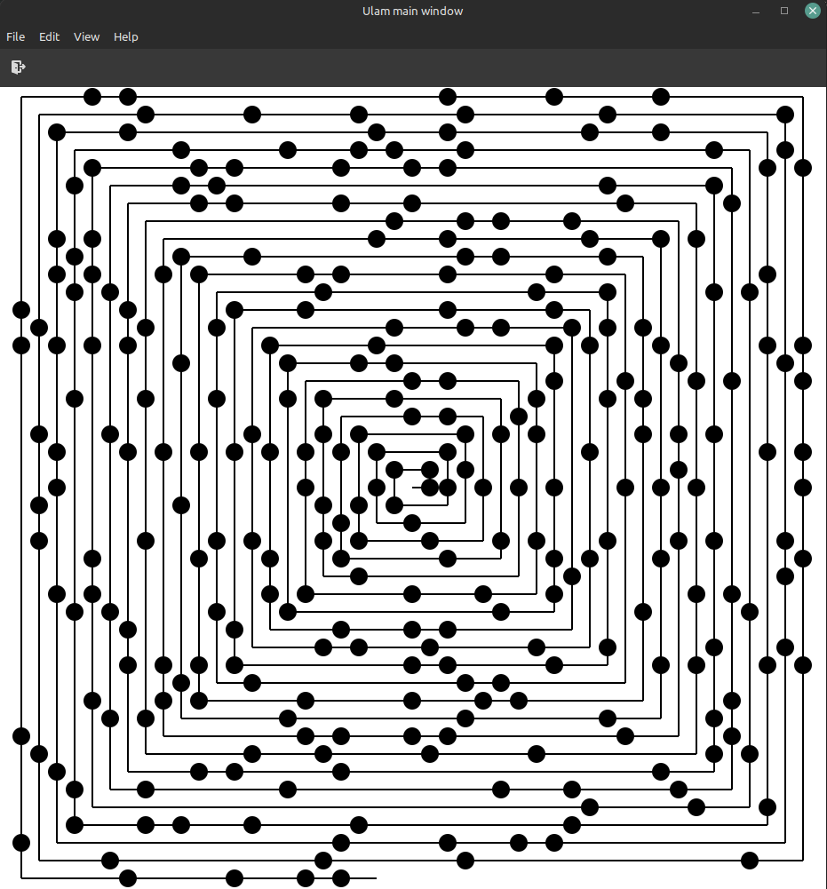

# ULAM

An application that draws a prime number spiral, an Ulam spiral, in GTK and Go.

## LINKS

* Inspiration came from Coding Trains video : https://www.youtube.com/watch?v=a35KWEjRvc0
* More info in Numberphiles video : https://www.youtube.com/watch?v=iFuR97YcSLM
* Prime number algorithm : https://www.cloudhadoop.com/2018/12/golang-example-program-to-check-number.html

## SCREENSHOT

## TODO
